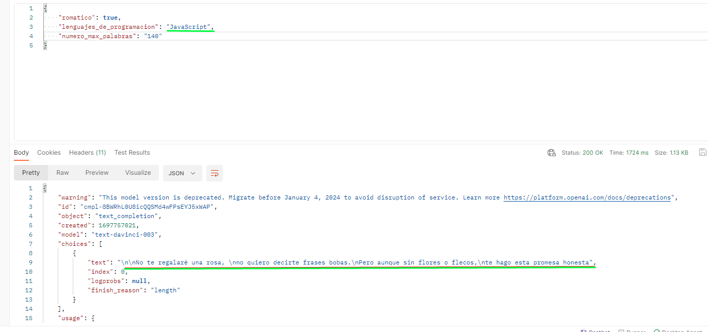

# API Poemas AWS Lambda

Aprendizaje del ecosistema SERVERLESS con Serverless Framework

  

## Instalación

Solo debes copiar el repositorio tal como muestra la imagen

  

luego ve a la terminal y haz un git clone tal como muestra la imagen

  

Ubicas donde se ha descargado el repositorio y ya puedes comenzar a manipularlo

## Quieres saber como crear tus propias variables de entorno [aqui](https://docs.aws.amazon.com/es_es/systems-manager/latest/userguide/systems-manager-parameter-store.html)

### Un video que me ayudo mucho aqui: [Como crear variables de entorno AWS](https://www.youtube.com/watch?v=8VW8wiVoxjU)

## ¿No sabes como crear permisos y un user AIM? [aqui](https://www.youtube.com/watch?v=mXisf92pn3g)

## Happy Coding

Sientete libre de hacer los cambios que creas pertinentes.